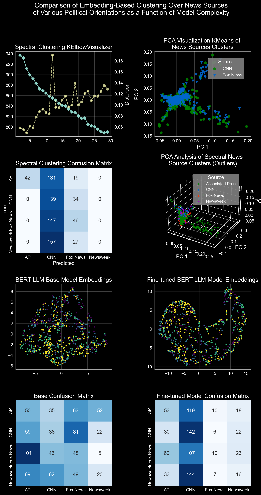

**Note:** All works by Darien Nouri

# News Title Classification on Major News Sources

**File:** `news_headline_classification.ipynb`

This repo contains an adaptation of another project to explore whether textual embeddings of news headlines can be linked to political orientation and sentiment. The primary goal is to investigate if we can identify the political orientation of news sources based on the textual context and words used in their article headlines.

Given that I had previously scraped news headlines data during another project, I thought it would be a cool idea to investigate this further. The steps in this notebook include:

- **Clustering and Visualization**:
  - Visualize PC2 and PC3 of the TF-IDF matrix to see if there are any patterns.
  - Visualize confusion matrix for clustering results.
- **Clustering**:
  - Reprocess data with outliers and perform clustering again.
  - Apply spectral clustering and compare with K-Means.
  - Attempt classification on all news sources.
  - Attempt classification specifically on CNN and Fox News given their differing political orientations.
  
### Enhanced Textual Embeddings with BERT LLM & Advanced Clustering

To enhance the textual embeddings we can try out a transformer-based embeddings such as BERT. To get a through understanding of how more complex models perform, DBSCAN and Hierarchical Clustering are also applied and compared.

- **Transformer-based Embeddings**:
  - Generate embeddings using a pre-trained BERT model.
  - Generate embeddings using a fine-tuned BERT model specifically for news headlines.
- **Advanced Clustering**:
  - Apply DBSCAN clustering and visualize the results.
  - Apply Agglomerative Clustering and visualize the results.
  - Compare the clustering results using confusion matrices.
  - Visualize the embeddings using PCA and t-SNE for both base and fine-tuned BERT models.




---

# Original Project Overview

## Explanation of procedure and findings

### Three subsets of data configurations are explored

1. News Title classification on 4 news sources keep     
    ['CNN', 'Associated Press', 'Newsweek', 'Fox News']
- Findings: Most headlines were very similar to each other, and the model was not able to classify them into different clusters. However, as seen in PC2 is seems that some outliers in the dataset can be sucessfully classified. So, I preprocessed and trained anoter model using only outliers, or rather all headlies that were not classified in the first cluster. 

Confusion Matrix of Kmeans on 4 News Sources and 4 Clusters (cluster per political orientation)
              precision    recall  f1-score   support

           0       0.21      0.69      0.32       200
           1       0.47      0.14      0.22       200
           2       0.11      0.01      0.03       200
           3       0.00      0.00      0.00       200

    accuracy                           0.21       800
   macro avg       0.20      0.21      0.14       800
weighted avg       0.20      0.21      0.14       800

2. News Title classification on 4 news sources using ONLY outliers in the dataset 'CNN', 'Associated Press', 'Newsweek', 'Fox News'

- Findings: Better results with distinct clusters, however the respective labels for each cluster do not directly correspond to the news source with high accuracy. Please disregard the plot names, they are not entierly accurate. For further inspection into determining if new headlines can be classified into the correct news sources, I evaluated headlines from CNN and Fox News, given their opposing political orientations.

Confusion Matrix of Spectral Clustering on 4 News Sources and 4 Clusters (cluster per political orientation) Extremes ONLY
              precision    recall  f1-score   support

           0       0.26      0.96      0.41       200
           1       0.43      0.03      0.06       200
           2       0.18      0.01      0.02       200
           3       0.31      0.06      0.10       200

    accuracy                           0.27       800
   macro avg       0.30      0.27      0.15       800
weighted avg       0.30      0.27      0.15       800


3. News Title classification on 2 news sources 'CNN', 'Fox News' 

- Findings: The model was able to classify headlines into 2 clusters, with high accuracy. The model was able to classify headlines from CNN and Fox News with high accuracy. This model performed fairly poorly given a recall of only 0.09 for the CNN cluster and 0.96 for the Fox News cluster. 
              precision    recall  f1-score   support

           0       0.68      0.09      0.16       450
           1       0.51      0.96      0.67       450

    accuracy                           0.52       900
   macro avg       0.60      0.52      0.41       900
weighted avg       0.60      0.52      0.41       900


## Overviews of process

News Headline Text Classification
This Python code attempts to classify news articles headlines from various sources using text classification.

- Classes of Interest
The code classifies news articles into one of the four political orientation clusters. The political orientation of news sources is based on their bias and the audience they cater to. The following are the political orientation clusters:

- Liberal: News sources that lean left politically.
- Moderate: News sources that are neutral politically.
- Conservative: News sources that lean right politically.
- Unknown: News sources that are difficult to categorize politically.
General Steps for Each Section of Analysis
Data Import and Cleaning
The first step is to import the data from various csv files, merge them into one dataframe, and clean the data by removing any null values and duplicates. Then, only the news sources that are of interest are kept in the dataset.

#### Text Preprocessing
The next step is to preprocess the text data by removing stop words, special characters, and numbers. The Named Entity Recognition (NER) is used to extract important information such as names, places, and organizations. Desired bigrams are then extracted from the NER results.

#### Feature Extraction
The cleaned and preprocessed text data is then converted into a term-frequency inverse document frequency (TF-IDF) matrix. The cosine similarity between each document is calculated using the TF-IDF matrix.

#### Model Training
The cosine similarity matrix is used to train two clustering models - KMeans and Spectral Clustering. The Elbow Method is used to determine the optimal number of clusters for both the models. The KMeans and Spectral Clustering models are then trained using the determined number of clusters.

#### Visualization
Principal Component Analysis (PCA) is applied to reduce the dimensionality of the data and to visualize the clusters in two dimensions. The scree plot is used to determine the optimal number of principal components. The clusters are then plotted using matplotlib and plotly.

#### Results and Evaluation
The confusion matrix and classification report are generated to evaluate the performance of both the KMeans and Spectral Clustering models. The performance of the models is evaluated in terms of accuracy, precision, recall, and F1 score. The confusion matrix is plotted using seaborn.


---

# Custom NLP-Doc Classification Library Overview 

This repository contains Python implementations of various text preprocessing techniques, clustering, and visualizations. The classes included are:

1. TextPreprocessing
2. TfidfVectorizer
3. ModelTraining
4. Visualizations

## TextPreprocessing

The `TextPreprocessing` class includes methods for preprocessing and tokenizing text documents. It utilizes libraries such as NLTK, spaCy, and regular expressions to perform tasks such as:

- Decontracting words (e.g., "won't" to "will not")
- Removing punctuation
- Tokenizing words
- Lemmatizing words
- Removing stop words
- Named entity recognition (NER)
- Extracting bigrams
- Combining NER and bigrams

## TfidfVectorizer

The `TfidfVectorizer` class is a custom implementation of the TF-IDF (Term Frequency-Inverse Document Frequency) vectorization technique. This class calculates the TF-IDF scores for a given set of documents and returns the top `n` terms with the highest TF-IDF scores for each document. The class also includes a method to create a term frequency matrix for the given documents.

## ModelTraining

The `ModelTraining` class includes methods for training clustering models using various similarity/distance metrics, such as:

- Cosine similarity
- Euclidean distance

The class also includes methods for fitting clustering models, such as:

- PCA (Principal Component Analysis)
- K-Means clustering
- K-Means++ clustering
- Spectral clustering

Additionally, the class provides methods for calculating evaluation metrics, such as accuracy, precision, recall, and F1-score, and for reordering labels for proper grouping.

## Visualizations

The `Visualizations` class includes methods for visualizing various aspects of the data and clustering models, such as:

- Elbow method for finding the optimal number of clusters
- Confusion matrix
- 2D and 3D PCA plots
- 2D t-SNE plot
- Explained variance plot
- Eigenvectors plot
- Top bigrams plot
- K-Means centroids plot

# Dependencies

To use these classes, you will need to install the following Python libraries:

- numpy
- pandas
- nltk
- spacy
- scikit-learn
- seaborn
- matplotlib

# Usage

To use the classes in this repository, simply import the classes and create instances of them. Then, you can call the class methods to preprocess text, vectorize documents, train clustering models, and visualize the results.

For example:

```python
from text_preprocessing import TextPreprocessing
from tfidf_vectorizer import TfidfVectorizer
from model_training import ModelTraining
from visualizations import Visualizations

# Preprocess the text documents
preprocessor = TextPreprocessing()
preprocessed_docs = preprocessor.preprocessing_pipeline(documents)

# Vectorize the documents using TF-IDF
tfidf_vectorizer = TfidfVectorizer(preprocessed_docs)
tfidf_vectors = tfidf_vectorizer.create_tf_idf_vectors()

# Train a K-Means clustering model
model_trainer = ModelTraining()
kmeans_model = model_trainer.fit_kmeans(tfidf_vectors, n_clusters=3)

# Visualize the results
visualizer = Visualizations()
visualizer.plot_kmeans_centnoids(tfidf_vectors, kmeans_model)
```

Please refer to the class methods and their docstrings for more information on their usage and expected input/output types.
